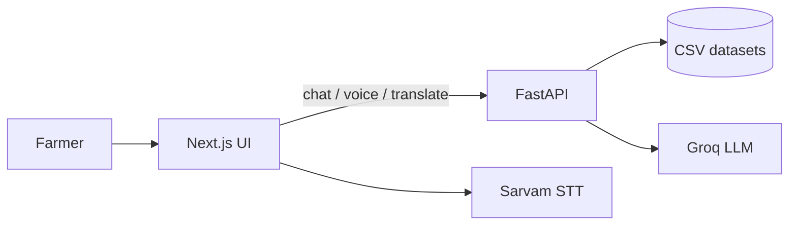

# PashuMitra AI

**Multilingual livestock health triage for rural farmers** describe symptoms by text or voice, get disease possibilities with confidence, first-aid guidance, and a veterinarian alert you can share on WhatsApp.

Built for **cattle, buffalo, goat, and sheep** with support for **English, Hindi, Kannada**, and additional Indic languages in the UI.

---

## Features

- **Conversational triage** — ChatGPT-style UI with sidebar history, typing indicators, and structured assistant cards
- **Dataset-driven diagnosis** — Diseases, symptoms, weights, and follow-up questions loaded from CSV (`backend/datasets/`)
- **Diagnostic intelligence** — Conversation memory, information-gain questioning, evidence-based confidence, disease differentiation
- **Multilingual input** — Farmer phrases in English, Hindi, Kannada (and more) mapped to canonical symptoms
- **Voice input** — [Sarvam AI](https://www.sarvam.ai/) speech-to-text for Indic languages (`saaras:v3`)
- **Text-to-speech** — Edge TTS for “Listen” on assistant messages
- **Translation** — Groq LLM with static phrase fallbacks when API limits apply
- **Vet alert draft** — WhatsApp-formatted message with **Share on WhatsApp** (`wa.me` — no Meta/Twilio APIs)
- **Domain guard** — Blocks off-topic queries (sports, general knowledge) during triage
- **Supported-animal guard** — Blocks diagnosis for pig, poultry, and other non-livestock species

> **Disclaimer:** PashuMitra AI is a **preliminary triage assistant**, not a replacement for a licensed veterinarian. Always consult a vet for treatment decisions.

---

## Architecture



| Layer | Stack |
|-------|--------|
| Frontend | Next.js 15, React 19, Tailwind, Zustand |
| Backend | FastAPI, Pydantic, feature modules |
| Diagnosis | `DiseaseRepository` + weighted confidence + triage tiers |
| Voice STT | Sarvam (default) · Faster Whisper · mock |
| Translation / optional extraction | Groq (`llama-3.3-70b-versatile`) |

---

## Quick start

### Prerequisites

- **Python 3.11+**
- **Node.js 20+**
- API keys (optional but recommended):
  - [Sarvam](https://www.sarvam.ai/) — voice transcription
  - [Groq](https://console.groq.com/) — translation and optional symptom extraction

### Backend

```bash
cd backend
python -m venv .venv

# Windows
.venv\Scripts\activate

# macOS / Linux
source .venv/bin/activate

pip install -r requirements.txt
copy .env.example .env    # Windows: copy
# cp .env.example .env    # macOS / Linux — then edit .env

uvicorn main:app --reload
```

API: **http://localhost:8000** · Docs: **http://localhost:8000/docs**

### Frontend

```bash
cd frontend
npm install
copy .env.local.example .env.local    # Windows
# cp .env.local.example .env.local

npm run dev
```

App: **http://localhost:3000** · Main route: **http://localhost:3000/chat**

Set in `frontend/.env.local`:

```env
NEXT_PUBLIC_API_URL=http://localhost:8000
```

---

## Configuration

### Backend (`backend/.env`)

| Variable | Purpose |
|----------|---------|
| `SARVAM_API_KEY` | Sarvam speech-to-text |
| `VOICE_STT_PROVIDER` | `sarvam` · `auto` · `whisper` · `mock` |
| `GROQ_API_KEY` | Translation and optional LLM symptom extraction |
| `TRANSLATION_PROVIDER` | `auto` · `groq` · `mock` |
| `USE_GROQ_EXTRACTION` | `true` to parse symptoms via Groq (default: rule-based) |
| `VET_WHATSAPP_PHONE` | Optional vet number for WhatsApp share (digits + country code) |
| `CORS_ORIGINS` | Frontend origin(s), e.g. `["http://localhost:3000"]` |

See [`backend/.env.example`](backend/.env.example) for the full list.

### Frontend (`frontend/.env.local`)

| Variable | Purpose |
|----------|---------|
| `NEXT_PUBLIC_API_URL` | Backend base URL |
| `NEXT_PUBLIC_VET_WHATSAPP_PHONE` | Client-side fallback for WhatsApp share target |

---

## User flow

1. Open **Chat** and choose language (e.g. English, Hindi, Kannada).
2. Describe the animal and symptoms — **type** or use the **microphone**.
3. Answer **yes/no** follow-up questions when the system needs more detail.
4. Review **disease analysis**, **first aid**, and (when ready) generate an **SMS / WhatsApp alert draft**.
5. Tap **Share on WhatsApp** to open `wa.me` with the message pre-filled.

---

## API overview

| Prefix | Description |
|--------|-------------|
| `GET /api/v1/health` | Health check |
| `/api/v1/chat` | Create chat, send messages, SMS draft |
| `/api/v1/memory` | Chat history and context |
| `/api/v1/voice` | Transcribe audio, text-to-speech |
| `/api/v1/translation` | Translate text |
| `/api/v1/rag` · `/api/v1/triage` · `/api/v1/confidence` | Diagnostic services (libraries + partial HTTP stubs) |

Details: [`docs/api-contracts.md`](docs/api-contracts.md)

---

## Datasets

Curated CSV files under [`backend/datasets/`](backend/datasets/):

| File | Role |
|------|------|
| `animals.csv` | Supported species and aliases |
| `diseases.csv` | Disease metadata |
| `symptoms.csv` | Canonical symptoms + multilingual aliases |
| `disease_symptom_mapping.csv` | Weighted scoring |
| `followup_questions.csv` | Diagnostic yes/no questions |
| `first_aid.csv` | First-aid steps |
| `sms_templates.csv` | Vet alert templates |

See [`backend/datasets/README.md`](backend/datasets/README.md) and [`docs/dataset_driven_diagnosis_architecture.md`](docs/dataset_driven_diagnosis_architecture.md).

**Current disease coverage:** Anthrax, Foot and Mouth Disease, Lumpy Skin Disease, Mastitis, Brucellosis.

Audit datasets:

```bash
cd backend
python scripts/audit_datasets.py
```

---

## Project structure

```
PashuMitra AI/
├── frontend/                 # Next.js chat, voice, translation UI
│   └── src/
│       ├── app/              # Routes (/chat, /voice, …)
│       ├── components/chat/  # Message cards, input, sidebar
│       └── lib/              # WhatsApp share, alert text, API helpers
├── backend/
│   ├── features/             # chat, voice, translation, rag, triage, sms_alerts, …
│   ├── datasets/             # CSV knowledge base
│   ├── config/               # Settings from .env
│   └── main.py               # FastAPI app entry
└── docs/                     # Architecture, integration, and fix reports
```

---

## Testing

### Backend

```bash
cd backend
python -m pytest features/ -q
```

### Frontend

```bash
cd frontend
npm test
```

---

## Documentation

| Topic | Document |
|-------|----------|
| Implementation overview | [`implementation.md`](implementation.md) |
| Dataset-driven diagnosis | [`docs/dataset_driven_diagnosis_architecture.md`](docs/dataset_driven_diagnosis_architecture.md) |
| Diagnostic intelligence | [`docs/diagnostic_intelligence_upgrade.md`](docs/diagnostic_intelligence_upgrade.md) |
| Supported animals | [`docs/supported_animals.md`](docs/supported_animals.md) |
| Sarvam STT | [`docs/sarvam_stt_integration_report.md`](docs/sarvam_stt_integration_report.md) |
| WhatsApp share | [`docs/whatsapp_share_integration.md`](docs/whatsapp_share_integration.md) |
| Hackathon demo | [`docs/hackathon-runbook.md`](docs/hackathon-runbook.md) |
| Developer ownership | [`docs/ownership.md`](docs/ownership.md) |

---

## Security notes

- **Never commit** `backend/.env` or `frontend/.env.local` — they contain API keys.
- Use `.env.example` files as templates only.
- Rotate keys if they were exposed in logs, screenshots, or version control.

---

## Contributing

The codebase uses a **feature-first** layout under `backend/features/`. Match existing patterns (orchestrator → diagnosis → message builder), extend CSV datasets for new diseases, and add tests under `features/*/tests/`.

---

## License

Add your project license here (e.g. MIT) if this repository is published publicly.
