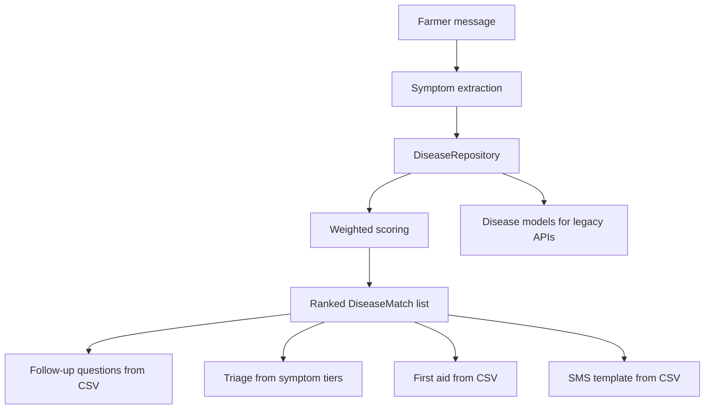

# Dataset-Driven Diagnosis Architecture

PashuMitra AI diagnosis is driven by tabular datasets under `backend/datasets/`. Adding diseases, symptoms, animals, triage rules, first-aid steps, follow-up questions, and SMS templates should require **dataset edits only**, not Python changes.

## Current limitations (before this refactor)

| Limitation | Impact |
|------------|--------|
| Five hand-authored JSON files in `datasets/examples/` | Adding a disease required a new JSON file and code updates |
| Symptom overlap ratio scoring | All symptoms weighted equally; no per-symptom importance |
| Hardcoded `DISEASE_SPECIFIC_QUESTIONS` | Follow-up questions duplicated in Python |
| Hardcoded `CRITICAL_SYMPTOMS` / `URGENT_SYMPTOMS` | Triage tiers not editable without deploy |
| Hardcoded disease mention aliases | ASR/typo corrections required code changes |
| `animal_type` ignored in retrieval | All five cattle JSON diseases scored for every species |
| 43k-row CSV in `datasets/raw/` | Training data not connected to runtime diagnosis |
| Scattered alias dictionaries | English/Kannada/Hindi mappings split across modules |

## New architecture



### Core abstraction: `DiseaseRepository`

Location: `backend/features/rag/repositories/disease_repository.py`

- Loads CSV datasets at startup (JSON loader ready for future formats)
- Exposes query methods for animals, symptoms, diseases, weights, follow-ups, first aid, SMS
- Builds validated `Disease` Pydantic models for backward-compatible APIs
- Provides alias resolution and equivalence groups for multilingual matching

### Scoring pipeline

1. Extract symptoms from farmer text
2. Load disease mappings filtered by `animal_type`
3. Compute **weighted score**: `sum(matched weights) / sum(all weights for disease)`
4. Rank diseases by confidence
5. Generate follow-up questions for missing **high-weight** symptoms (from `followup_questions.csv`)
6. Return diagnosis response (unchanged API shape)

No disease-specific Python branches remain in the scoring or question services.

## Dataset files

All paths relative to `backend/datasets/`.

### `animals.csv`

| Column | Description |
|--------|-------------|
| `animal_id` | Canonical ID (`cattle`, `buffalo`, …) |
| `animal_name` | Display name |
| `aliases` | Semicolon-separated English, romanized, Kannada, Hindi forms |
| `supported` | `true` if chat diagnosis is allowed (`supported_animals.py` still gates chat to four species) |

Example:

```csv
cattle,cattle,"cow;cattle;hasu;gai;ಹಸು;गाय",true
```

### `diseases.csv`

| Column | Description |
|--------|-------------|
| `disease_id` | Stable key |
| `disease_name` | Display name |
| `animal_types` | Pipe-separated species (`cattle\|buffalo\|goat`) |
| `severity` | `low`, `medium`, `high`, `critical`, `urgent` |
| `description` | Clinical summary |
| `vet_required` | `true` / `false` |
| `aliases` | Semicolon-separated mention aliases |

### `symptoms.csv`

| Column | Description |
|--------|-------------|
| `symptom_id` | Stable key (`fever`, `mouth_blisters`, …) |
| `canonical_name` | English label used in API responses |
| `aliases` | Semicolon-separated multilingual aliases |
| `triage_tier` | Optional: `critical` or `urgent` (drives `TriageService`) |

Example:

```csv
fever,fever,"fever;jwara;bukhar;ಜ್ವರ;बुखार",urgent
```

### `disease_symptom_mapping.csv`

| Column | Description |
|--------|-------------|
| `disease_id` | Links to `diseases.csv` |
| `symptom_id` | Links to `symptoms.csv` |
| `weight` | Float 0–1; higher = more discriminating |

Example:

```csv
foot-and-mouth-disease,mouth_blisters,1.0
foot-and-mouth-disease,drooling,0.9
foot-and-mouth-disease,high_fever,0.7
```

### `followup_questions.csv`

| Column | Description |
|--------|-------------|
| `disease_id` | Disease key, or `_generic` for fever/evidence fallbacks |
| `question` | Farmer-friendly yes/no question |
| `symptom_checked` | Optional `symptom_id` being confirmed |

### `first_aid.csv`

| Column | Description |
|--------|-------------|
| `disease_id` | Disease key |
| `step_order` | Integer order |
| `instruction` | First-aid step text |

### `sms_templates.csv`

| Column | Description |
|--------|-------------|
| `disease_id` | Disease key |
| `template` | Message with placeholders: `{severity_header}`, `{animal_type}`, `{disease_name}`, `{confidence}`, `{symptoms}`, `{severity}` |

## How to add content

### Add a disease

1. Add a row to `diseases.csv`
2. Add symptom rows to `symptoms.csv` (if new symptoms)
3. Add weighted mappings to `disease_symptom_mapping.csv`
4. Add follow-up rows to `followup_questions.csv`
5. Add first-aid steps to `first_aid.csv`
6. Optional: add SMS row to `sms_templates.csv`
7. Restart the backend (repository loads at process start)

### Add an animal

1. Add a row to `animals.csv` with aliases
2. Set `supported=true` only if chat diagnosis should allow it
3. Update `animal_types` on relevant disease rows

### Add a symptom

1. Add a row to `symptoms.csv` with multilingual aliases
2. Link it in `disease_symptom_mapping.csv` with a weight
3. Optional: set `triage_tier` for automatic triage escalation
4. Optional: add a follow-up question referencing the `symptom_id`

### Migrate from legacy JSON

The five JSON files in `datasets/examples/` remain for reference and tests that use temporary JSON directories.

Run:

```bash
cd backend
python datasets/ingest.py
```

This exports JSON structure into CSV rows (mappings, first aid). The curated CSV files in the repo already include migrated content plus multilingual aliases and follow-up questions.

## Backward compatibility

| API / feature | Status |
|---------------|--------|
| `POST /api/v1/chat/{id}/message` | Unchanged request/response schema |
| `POST /api/v1/diagnose` | Unchanged |
| Voice / translation routes | Unaffected |
| `Disease` Pydantic model | Still used; built from repository |
| `DiseaseDocumentService.load_all()` | Returns repository-backed models by default |
| Tests with `documents_dir=tmp_path` | Still load JSON from temp dirs |

## Migration plan (5-disease JSON → datasets)

| Phase | Action | Status |
|-------|--------|--------|
| 1 | Author CSV datasets mirroring five JSON diseases | Done |
| 2 | Implement `DiseaseRepository` + weighted scoring | Done |
| 3 | Move follow-ups, triage tiers, SMS, mentions to datasets | Done |
| 4 | Filter retrieval by `animal_type` | Done |
| 5 | Keep `datasets/examples/` for tests and reference | Done |
| 6 | Expand to CSV training labels (blackleg, pneumonia, …) | Future |
| 7 | JSON dataset loader + hot reload API | Future |
| 8 | Vector RAG retriever implementing `DiseaseRetriever` | Future |

## Related files

| File | Role |
|------|------|
| `features/rag/repositories/disease_repository.py` | Dataset loader and queries |
| `features/confidence_scoring/services/confidence_service.py` | Weighted scoring |
| `features/rag/services/disease_document_service.py` | Legacy adapter |
| `features/rag/services/disease_retrieval_service.py` | Candidate ranking |
| `features/triage/services/diagnostic_question_service.py` | Dataset follow-ups |
| `features/triage/services/triage_service.py` | Symptom triage tiers |
| `features/chat/services/disease_mention_recognizer.py` | Disease aliases from CSV |
| `features/sms_alerts/services/sms_alert_service.py` | SMS templates |
| `features/rag/tests/test_disease_repository.py` | Repository tests |

## Tests

```bash
cd backend
python -m pytest features/rag/tests/test_disease_repository.py -q
python -m pytest features/chat/tests/ features/triage/tests/ features/rag/tests/ -q
```
