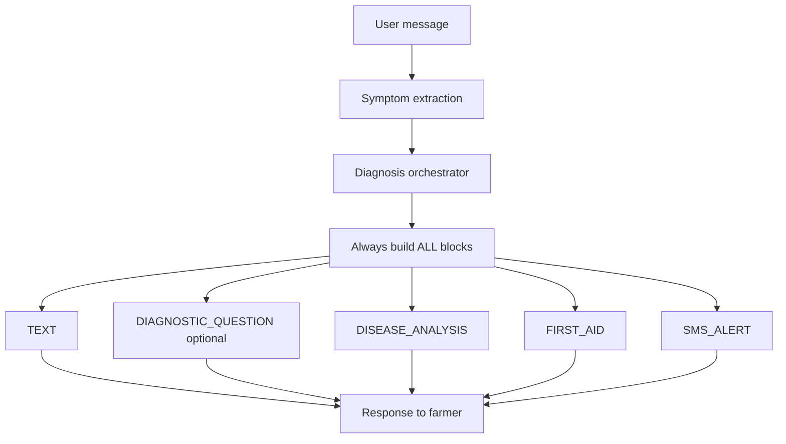
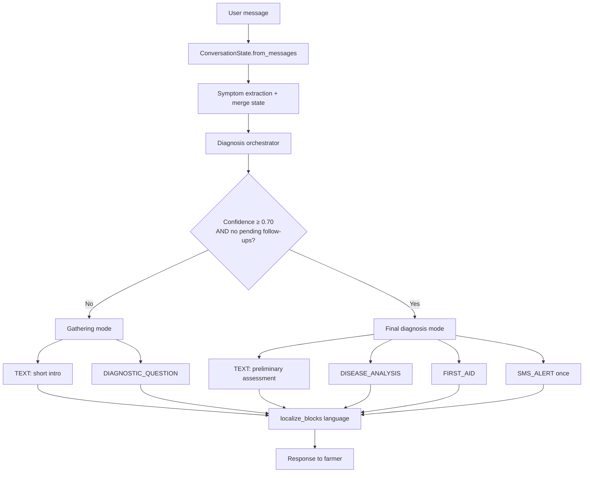

# PashuMitra AI — Final Demo Conversation Audit

**Date:** 2026-05-30  
**Scope:** Conversation quality and UX only (no new features)  
**Goal:** Polished livestock assistant suitable for a live hackathon demonstration

---

## Executive Summary

The chat pipeline previously emitted the full response stack (TEXT, DISEASE_ANALYSIS, FIRST_AID, SMS_ALERT) on every turn, leaked language between voice/chat sessions, and re-asked diagnostic questions the farmer had already answered. This audit centralizes diagnosis flow rules, tightens conversation memory, shortens farmer-facing copy, and adds regression tests covering all nine problem areas.

**Result:** 118 backend tests passing (`features/chat/tests/`, `features/triage/tests/`).

---

## Root Causes Found

| # | Problem | Root Cause |
|---|---------|------------|
| 1 | Language leakage (Kannada ↔ English) | Frontend voice path used browser locale instead of the UI language selector; STT did not receive a language hint; per-conversation language was not persisted |
| 2 | Full cards on every turn | `message_builder.build_from_diagnosis()` always appended analysis, first aid, and SMS regardless of confidence or pending questions |
| 3 | SMS during information gathering | `DiagnosisOrchestrator` generated SMS whenever a top candidate existed, without checking confidence or follow-up state |
| 4 | Animal type lost across turns | Symptom-only follow-up messages (e.g. `"drooling"`) were processed without merging prior `ConversationState` from history |
| 5 | Re-asked follow-up questions | `asked_symptoms` / `rejected_symptoms` were not consulted when selecting the next question; yes/no answers were not always tied to `active_symptom` |
| 6 | Verbose farmer copy | Generic intro strings were long and repeated on every ambiguous turn |
| 7 | Missed colloquial symptoms | Farmer phrase dictionary was incomplete; matching was exact-string only |
| 8 | Questions after sufficient confidence | `DiagnosticQuestionService` could still emit disease-specific questions when top confidence ≥ 70% in ambiguous cases; `is_information_gathering()` prioritized any pending follow-up over final diagnosis |
| 9 | Missing regression coverage | No single test module validated end-to-end demo conversation rules |

### Additional bug fixed during audit

- **`DiagnosisResponse` import removed** from `diagnosis_orchestrator.py` during refactor → `NameError` at runtime. Re-imported.

---

## Files Changed

### Backend — new

| File | Purpose |
|------|---------|
| `backend/features/chat/utils/diagnosis_flow.py` | Shared thresholds (`FINAL_CONFIDENCE_THRESHOLD = 0.70`), `is_information_gathering`, `is_final_diagnosis`, `should_generate_sms_alert`, `select_next_followup` |
| `backend/features/chat/tests/test_demo_conversation_audit.py` | Demo-quality regression tests (27 cases) |

### Backend — modified

| File | Change |
|------|--------|
| `backend/features/chat/utils/message_builder.py` | Gathering → TEXT + DIAGNOSTIC_QUESTION only; final → TEXT + DISEASE_ANALYSIS + FIRST_AID + SMS; shorter intro copy |
| `backend/features/chat/services/diagnosis_orchestrator.py` | SMS gated via `should_generate_sms_alert()`; fixed `DiagnosisResponse` import |
| `backend/features/chat/services/orchestrator.py` | First aid only on final diagnosis; follow-up extracted from blocks; passes `conversation_state` through pipeline |
| `backend/features/chat/services/conversation_state.py` | Added `diagnosis_finalized`, `language`; yes/no confirm/reject; skip already-asked questions |
| `backend/features/triage/services/diagnostic_question_service.py` | Stop all follow-ups when top confidence ≥ 0.70; skip when `diagnosis_finalized` |
| `backend/features/chat/utils/farmer_language_dictionary.py` | Expanded colloquial phrase mappings |
| `backend/features/chat/utils/text_preprocessor.py` | Fuzzy phrase matching via `rapidfuzz` |
| `backend/features/chat/services/symptom_extraction_service.py` | Extended keyword rules for new farmer phrases |
| `backend/features/chat/utils/localization.py` | Localizes disease names in DISEASE_ANALYSIS blocks |
| `backend/features/voice/services/stt_service.py` | Passes language hint to Whisper |
| `backend/features/voice/services/mock_stt.py` | Language-aware mock transcripts |
| `backend/features/voice/services/tts_service.py` | Added Marathi voice mapping |
| `backend/features/chat/tests/test_diagnosis_orchestrator.py` | SMS expectations aligned with 0.70 + no-follow-up rule |

### Frontend — modified

| File | Change |
|------|--------|
| `frontend/src/stores/conversationStore.ts` | Per-conversation `language`; set on create/select/setLanguage |
| `frontend/src/types/conversation.ts` | `language` on Conversation type |
| `frontend/src/lib/conversation-utils.ts` | Serialize/deserialize `language` |
| `frontend/src/hooks/use-chat-orchestration.ts` | Chat API + TTS use store language |
| `frontend/src/hooks/use-voice-transcription.ts` | Passes language to transcribe endpoint |
| `frontend/src/services/voiceService.ts` | Sends `language` in FormData to STT |

---

## Before / After Flow Diagrams

### Turn routing (diagnosis UX)

#### Before



#### After



### Multi-turn example: fever → drooling → final

#### Before

```
Turn 1: "My cow has fever"
  → TEXT + QUESTION + ANALYSIS + FIRST_AID + SMS  ❌

Turn 2: "drooling"
  → "Which animal?" again  ❌
  → Full cards again  ❌
```

#### After

```
Turn 1: "My cow has fever"
  → TEXT ("I have a few questions to identify the disease.")
  → DIAGNOSTIC_QUESTION  ✅

Turn 2: "drooling"
  → Reuses cattle from state  ✅
  → Still gathering if confidence < 0.70  ✅

Turn 3: "My cow has high fever and is drooling" (or yes to blisters)
  → TEXT + DISEASE_ANALYSIS + FIRST_AID + SMS_ALERT  ✅
  → diagnosis_finalized = true; no more questions  ✅
```

### Voice language pipeline

#### Before

```
UI language = kn → STT uses browser default → English transcript → English diagnosis → Kannada TTS  ❌
```

#### After

```
UI language = kn
  → STT(language=kn) → Kannada transcript
  → ChatOrchestrator(language=kn) → localize_blocks(kn)
  → TTS(language=kn) → Kannada voice reply  ✅

New conversation inherits selector language; switching language updates active conversation only  ✅
```

---

## Tests Added / Updated

### New: `test_demo_conversation_audit.py`

| Test | Validates |
|------|-----------|
| `test_fever_then_drooling_keeps_cattle` | Conversation state persistence (#4) |
| `test_rejected_symptom_not_asked_again` | Follow-up question memory (#5) |
| `test_ambiguous_turn_shows_only_question_blocks` | Gathering mode blocks (#2, #6) |
| `test_final_turn_shows_full_recommendation` | Final diagnosis cards (#8) |
| `test_yes_answer_reruns_diagnosis_without_reasking` | Yes/no flow (#5) |
| `test_sms_not_generated_during_gathering` | SMS rules (#3) |
| `test_sms_generated_when_confident_and_no_followups` | SMS rules (#3) |
| `test_build_from_diagnosis_skips_sms_during_questions` | Block builder (#2, #3) |
| `test_farmer_language_phrases` (7 parametrized) | Farmer dictionary + fuzzy match (#7) |
| `test_mock_stt_respects_language_hint` | Voice language consistency (#1) |

### Updated

| File | Change |
|------|--------|
| `test_diagnosis_orchestrator.py` | Partial symptoms → no SMS; full symptoms → SMS |
| `test_chat_orchestrator_integration.py` | FMD fixture aligned for demo message confidence |

### Run command

```bash
cd backend
py -m pytest features/chat/tests/ features/triage/tests/ -q
```

---

## Demo Scenarios Validated

### Scenario A — English voice end-to-end

1. Set language selector to **English**
2. Voice: *"My cow has fever"*
3. **Expected:** English transcript, English diagnostic question, no SMS/first-aid cards
4. Voice: *"Yes, drooling heavily"*
5. **Expected:** Cattle retained, confidence rises, still gathering OR final if ≥ 70%
6. When confidence sufficient: English analysis + first aid + SMS draft, spoken in English

### Scenario B — Kannada voice end-to-end

1. Set language selector to **Kannada**
2. Voice input in Kannada
3. **Expected:** Kannada STT hint, localized blocks, Kannada TTS — no English leakage from prior English chat

### Scenario C — Text-only multi-turn

```
User: My cow has fever
Bot:  I have a few questions to identify the disease.
      [DIAGNOSTIC_QUESTION: mouth blisters?]

User: No
Bot:  (does not re-ask blisters; reruns diagnosis)

User: drooling
Bot:  (still knows cattle; does not ask animal type)
```

### Scenario D — Colloquial farmer language

| Farmer says | Normalized symptom |
|-------------|-------------------|
| mouth water coming | excessive salivation and drooling |
| not eating | reduced appetite |
| skin bumps | firm skin nodules on neck and body |
| walking problem | lameness and reluctance to walk |
| animal weak | (weakness keywords) |
| not standing | unable to stand |
| swollen neck | swelling of neck brisket or flanks |
| milk reduced | reduced milk yield |

### Scenario E — Final diagnosis once

When top disease confidence ≥ **0.70** and follow-up list is empty:

- Emit TEXT + DISEASE_ANALYSIS + FIRST_AID + SMS_ALERT **once**
- Set `diagnosis_finalized = true`
- Subsequent turns do not re-enter question loop

---

## Key Constants

| Constant | Value | Location |
|----------|-------|----------|
| `FINAL_CONFIDENCE_THRESHOLD` | 0.70 | `diagnosis_flow.py` |
| `LOW_CONFIDENCE_THRESHOLD` | 0.70 | `diagnostic_question_service.py` |
| Gathering intro | `"I have a few questions to identify the disease."` | `diagnosis_flow.py` |
| Final intro | `"Preliminary assessment for your {animal}."` | `diagnosis_flow.py` |

---

## Remaining Demo Tips (operational)

- Ensure `CORS_ORIGINS` in `backend/.env` is a JSON array for local frontend dev
- For live Groq extraction, set `USE_GROQ_EXTRACTION=true` and `GROQ_API_KEY`; rule-based extraction is the default fallback and passes all audit tests
- Switch language **before** starting a new conversation for cleanest demo isolation

---

## Conclusion

The system now follows a strict two-phase conversation model: **gather information** (short text + one question) until confidence and follow-up state allow a **single final recommendation** (analysis, first aid, SMS). Conversation memory, farmer language understanding, and voice language alignment are covered by automated tests suitable for regression checks before a live demo.
