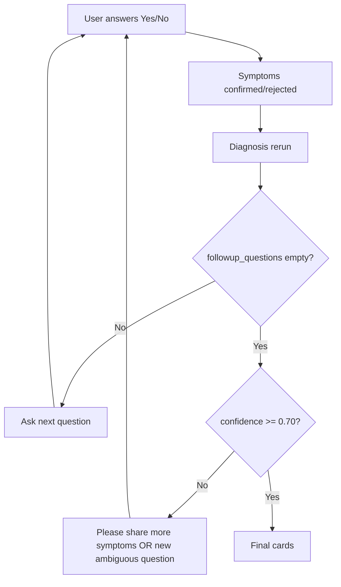
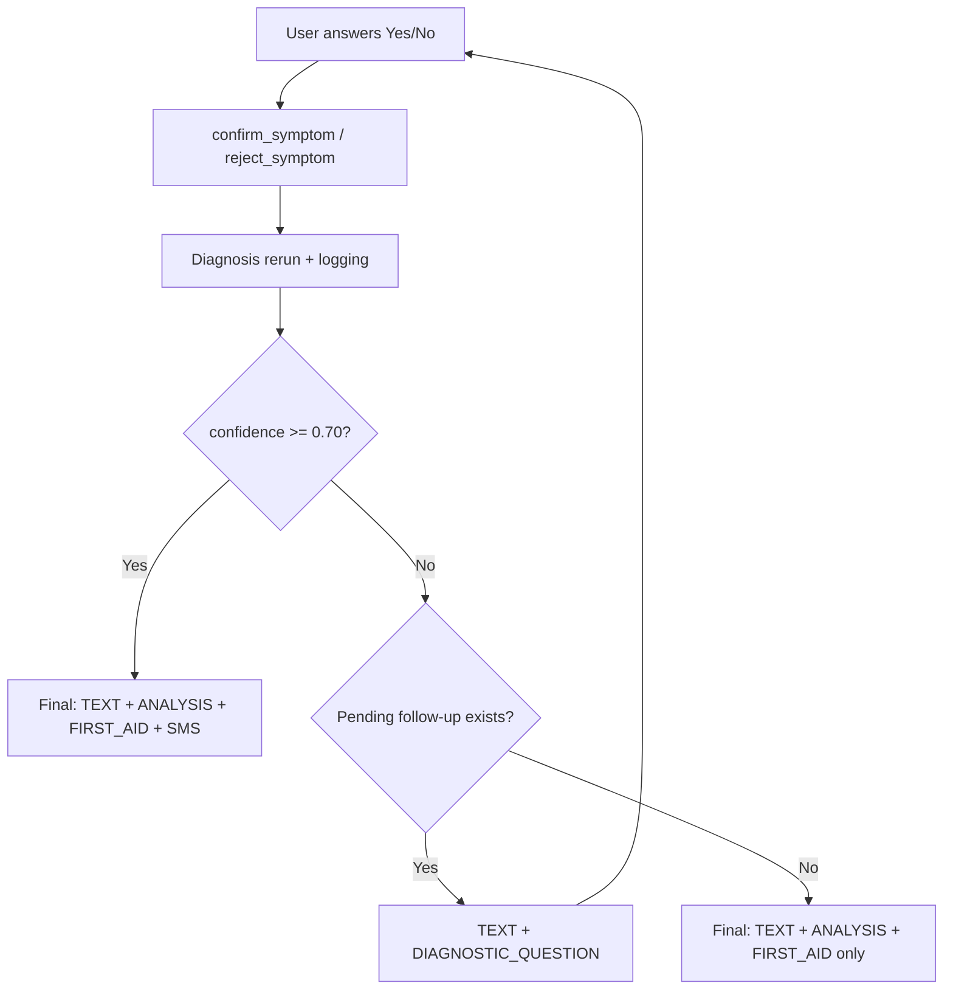

# Diagnosis Finalization Bug Report

**Date:** 2026-05-30  
**Issue:** Assistant kept asking diagnostic questions and never reached a final diagnosis.

---

## Root Cause

Three compounding logic bugs after the conversation audit:

### 1. Finalization required confidence ≥ 0.70 even when questioning was done

`is_final_diagnosis()` required **both**:
- no pending follow-up, **and**
- confidence ≥ 0.70

When follow-ups were exhausted (all disease-specific / distinguishing symptoms asked), confidence often remained below 0.70 (e.g. 0.25 for partial symptom overlap). The builder then fell through to *"Please share any other symptoms"* instead of showing analysis, first aid, and stopping the question loop.

### 2. Ambiguous questioning never exhausted

`DiagnosticQuestionService._ambiguous_questions()` did not exclude **already-asked** symptoms when selecting distinguishing symptoms. Each turn could surface new questions from the full disease corpus while scores stayed tied (e.g. fever → 0.12 for many diseases).

### 3. Disease-specific templates ignored the disease catalog

FMD templates include mouth blisters, but a minimal FMD fixture with only `high fever` + `drooling` still asked about blisters first. Confirming blisters did not increase confidence because blisters are not in that disease’s symptom list.

### Secondary issues

- `requires_more_information` was inverted when no candidates matched.
- Rejected symptoms were not consistently skipped in `should_skip_question`.
- No structured logging to trace yes/no → confidence → finalization decisions.

**Yes/No handling itself was correct** — `confirm_symptom` / `reject_symptom` ran and diagnosis was rerun. The bug was in **when** the pipeline chose to stop asking and render final cards.

---

## Files Modified

| File | Change |
|------|--------|
| `backend/features/chat/utils/diagnosis_flow.py` | Split `should_show_final_diagnosis` (analysis + first aid) from `should_generate_sms_alert` (confidence ≥ 0.70); added `log_diagnosis_decision()` |
| `backend/features/chat/utils/message_builder.py` | Use `should_show_final_diagnosis` for final card rendering |
| `backend/features/chat/services/orchestrator.py` | Logging; first aid gated on `should_show_final_diagnosis` |
| `backend/features/chat/services/conversation_state.py` | Skip questions for rejected symptoms |
| `backend/features/chat/services/diagnosis_orchestrator.py` | Fixed `requires_more_information`; SMS still gated separately |
| `backend/features/triage/services/diagnostic_question_service.py` | Exclude asked symptoms in ambiguous + disease-specific paths; cap at 6 questions; templates limited to symptoms in disease catalog |
| `backend/features/chat/tests/test_diagnosis_finalization.py` | **New** regression tests |

---

## Before / After Flow

### Before (broken)



Result: infinite or very long question loops; never reached analysis.

### After (fixed)



Finalization triggers when:
- **confidence ≥ 0.70** (full stack including SMS), **or**
- **no pending follow-up** remains (question cap reached, all distinguishing / disease-specific symptoms asked or rejected)

---

## Tests Added

`backend/features/chat/tests/test_diagnosis_finalization.py`:

| Test | Validates |
|------|-----------|
| `test_yes_confirms_symptom_and_increases_confidence` | Confirmed symptoms stored; confidence rises |
| `test_no_rejects_symptom` | Rejected symptoms stored; question skipped |
| `test_fmd_question_then_yes_finalizes` | Q → Yes → final diagnosis with SMS at 100% confidence |
| `test_finalize_without_sms_when_confidence_below_threshold` | Analysis + first aid without SMS when confidence < 0.70 |
| `test_still_gathering_when_followup_pending` | Questions continue while follow-up pending |

Run:

```bash
cd backend
.\.venv\Scripts\python.exe -m pytest features/chat/tests/test_diagnosis_finalization.py -q
```

**123 tests** pass across `features/chat/tests/` and `features/triage/tests/`.

---

## Examples That Now Finalize Correctly

### Example A — FMD demo (isolated fixture)

```
User: My cow has high fever
Bot:  I have a few questions to identify the disease.
      [Is the animal drooling heavily or unable to eat?]

User: yes
Bot:  Preliminary assessment for your cattle.
      [DISEASE_ANALYSIS — FMD 100%]
      [FIRST_AID]
      [SMS_ALERT]
```

### Example B — Real corpus, partial evidence (turn cap)

After 6 answered questions with confidence still 0.25:

```
Bot:  Preliminary assessment for your cattle.
      [DISEASE_ANALYSIS — top candidate Mastitis 25%]
      [FIRST_AID]
      (no SMS — confidence below 0.70)
```

### Example C — High confidence on first rich message

```
User: My cow has high fever and is drooling
Bot:  Final diagnosis immediately (confidence 100%, all cards including SMS)
```

---

## Logging

Enable INFO logs for `features.chat.utils.diagnosis_flow` to audit each turn:

```
diagnosis_flow stage=after_yes_no symptoms=[...] confirmed=[...] rejected=[...]
confidence=0.250 followups=2 pending=drooling show_final=False sms=False finalized=False
```

After question exhaustion:

```
confidence=0.250 followups=0 pending=None show_final=True sms=False finalized=True
```

---

## Summary

The regression was not broken yes/no parsing — it was **over-strict finalization** combined with **unbounded ambiguous questioning**. Final cards now appear when evidence is sufficient **or** questioning is exhausted; SMS remains gated at **confidence ≥ 0.70** only.
